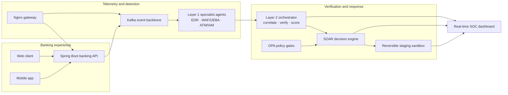

<div align="center">

# Little Boy's Aegis

### An AI-native cyber defense platform for modern banking

From customer transactions to the SOC: observe, correlate, verify, decide, and respond—without surrendering control.

[](https://github.com/orgs/Little-Boy-s-Aegis/repositories)
[](https://attack.mitre.org/)
[](https://capec.mitre.org/)
[](https://www.openpolicyagent.org/)

[Explore the platform](#the-platform) · [See the architecture](#how-aegis-works) · [Run it locally](#run-the-ecosystem) · [Browse every repository](https://github.com/orgs/Little-Boy-s-Aegis/repositories)

</div>

---

## Defense that reasons—and proves its work

Little Boy's Aegis is an end-to-end attack-and-defense environment built around a realistic digital banking system. Banking applications generate real operational telemetry. Specialist, read-only agents inspect that evidence. A second-layer orchestrator correlates and independently verifies findings before the SOAR engine can select a response.

The result is a security platform designed around three convictions:

- **Evidence before action.** Agent findings are signals, not verdicts. Layer 2 verifies them against clean logs and operational context.
- **Automation needs boundaries.** OPA policy, verification gates, scoped targets, approval modes, audit trails, and rollback data stand between a model decision and an environment-changing action.
- **Security should be observable.** Kafka event streams, structured schemas, a real-time SOC dashboard, and deterministic risk tables make the decision path inspectable.

## How Aegis works



### The decision path

1. **Observe** — the banking API, gateway, applications, and infrastructure emit security telemetry.
2. **Detect** — three domain specialists inspect internal network/EDR, e-banking/API/WAF/UEBA, and ATM/IAM signals.
3. **Correlate** — Layer 2 groups findings by concrete entities, time, technique, and plausible attack sequence.
4. **Verify** — claims are checked independently against clean logs and context; unsupported findings are capped or withheld from containment.
5. **Decide** — deterministic ATT&CK/CAPEC risk data and policy rules produce a schema-valid decision and playbook plan.
6. **Respond** — non-disruptive actions can be raised immediately; containment requires every safety gate to pass and remains scoped, reversible, and auditable.

## The platform

### Security intelligence and automation

| Repository | What it does |
|---|---|
| [`agent-layer-1`](https://github.com/Little-Boy-s-Aegis/agent-layer-1) | Read-only specialist agents for EDR, WAF/UEBA, and ATM/IAM telemetry. Emits masked, schema-validated findings mapped to MITRE ATT&CK and CAPEC. |
| [`agent-layer-2`](https://github.com/Little-Boy-s-Aegis/agent-layer-2) | The orchestration contract: correlation, independent verification, deterministic risk scoring, banking-specific response rules, output schemas, and playbooks. |
| [`aegis-soar-engine`](https://github.com/Little-Boy-s-Aegis/aegis-soar-engine) | Executable Python decision engine with Kafka ingestion, Redis incident state, database verification, policy evaluation, safety gates, rollback, audit integrity, threat-intelligence enrichment, and response connectors. |
| [`aegis-staging-sandbox`](https://github.com/Little-Boy-s-Aegis/aegis-staging-sandbox) | Authenticated simulation APIs for reversible Fortinet, CrowdStrike, Entra ID, and AWS WAF response workflows. |
| [`dashboard`](https://github.com/Little-Boy-s-Aegis/dashboard) | Go and React SOC workspace for live security events, incidents, file-integrity monitoring, attack simulation, and AI-assisted investigation. |

### Banking applications and delivery

| Repository | What it does |
|---|---|
| [`aegis-bank-backend`](https://github.com/Little-Boy-s-Aegis/aegis-bank-backend) | Spring Boot core banking REST API with PostgreSQL persistence, JWT authentication, Kafka event production, and attack/defense controls. |
| [`aegis-bank-web-client`](https://github.com/Little-Boy-s-Aegis/aegis-bank-web-client) | Next.js banking portal for customer workflows and security-control demonstrations. |
| [`aegis-bank-mobile-app`](https://github.com/Little-Boy-s-Aegis/aegis-bank-mobile-app) | Dart/Flutter mobile banking experience connected to the Aegis API. |
| [`aegis-bank-deployment`](https://github.com/Little-Boy-s-Aegis/aegis-bank-deployment) | Complete local and Kubernetes orchestration: Docker Compose, Helm, Kustomize, Nginx, Kafka KRaft, Fluent Bit, OPA, Vault, Redis, Qdrant, and security tests. |
| [`aegis-bank-terraform`](https://github.com/Little-Boy-s-Aegis/aegis-bank-terraform) | Modular AWS infrastructure for cost-optimized hackathon and multi-AZ production profiles, including identity, encryption, observability, edge, data, and AI services. |

## What makes the system different

### Split trust between sensors and decisions

Layer 1 cannot assign final risk, choose playbooks, authorize containment, or execute actions. Its job is to report masked evidence in a strict JSON contract. Layer 2 owns correlation and verification, preventing one confident sensor—or one prompt injection—from becoming an operational decision.

### Policy-gated response

Environment-changing containment is off by default. It requires a confirmed threat, independent Layer 2 verification, sufficient evidence strength and risk, an OPA allow decision, autopilot enablement, an approved execution window, a verified target, and a scoped, time-bound action with rollback available.

Critical banking operations—including core banking, SWIFT, HSM, ATM switch, critical VLAN, and disaster-recovery isolation—are **manual-only**.

### Threat knowledge that works offline

The project carries structured MITRE ATT&CK and CAPEC knowledge, surface multipliers, edge-case matrices, and calibrated `0–10` scoring tables. Decisions remain explainable even when external threat-intelligence services are unavailable.

### A full proving ground

The banking API, customer clients, SOC dashboard, multi-broker Kafka backbone, log pipeline, policy engine, secret management, vector database, response sandbox, and test suites run as one ecosystem. This makes Aegis useful for purple-team exercises, defensive AI research, playbook validation, and security engineering demonstrations.

## Technology map

| Area | Technologies |
|---|---|
| Experiences | Next.js, React, TypeScript, Flutter, Dart |
| Banking services | Java, Spring Boot, Hibernate/JPA, PostgreSQL |
| SOC and orchestration | Go, Python, Redis, Qdrant |
| Event and log pipeline | Apache Kafka KRaft, Fluent Bit |
| Security controls | Open Policy Agent, Vault, Nginx, JWT, audit/FIM controls |
| Platform engineering | Docker Compose, Kubernetes, Helm, Kustomize, Terraform, GitHub Actions |
| Threat knowledge | MITRE ATT&CK, CAPEC, CWE, deterministic risk calibration |

## Run the ecosystem

The fastest path is the deployment repository:

```bash
git clone https://github.com/Little-Boy-s-Aegis/aegis-bank-deployment.git
cd aegis-bank-deployment
cp .env.example .env
docker compose up --build -d
```

Then open the Nginx gateway at `http://localhost/`. The deployment guide documents the banking portal, SOC dashboard, APIs, Kafka tooling, service profiles, and Kubernetes options.

> [!IMPORTANT]
> Review every value in `.env` before use. Default and example credentials are for isolated local development only. Do not expose the stack—or its simulated vulnerable modes—to an untrusted network.

## Built for safe experimentation

Little Boy's Aegis is a research, education, and security-simulation project—not a certified banking product or a substitute for production security controls. Run offensive scenarios only in systems you own or are explicitly authorized to test. Validate policies, secrets, network boundaries, connectors, and rollback behavior before adapting any component to a real environment.

## Explore and contribute

Start with [`aegis-bank-deployment`](https://github.com/Little-Boy-s-Aegis/aegis-bank-deployment) to experience the complete system, or enter through the repository that matches your craft:

- Detection engineering: [`agent-layer-1`](https://github.com/Little-Boy-s-Aegis/agent-layer-1)
- Decision contracts and playbooks: [`agent-layer-2`](https://github.com/Little-Boy-s-Aegis/agent-layer-2)
- SOAR and integrations: [`aegis-soar-engine`](https://github.com/Little-Boy-s-Aegis/aegis-soar-engine)
- SOC experience: [`dashboard`](https://github.com/Little-Boy-s-Aegis/dashboard)
- Platform engineering: [`aegis-bank-deployment`](https://github.com/Little-Boy-s-Aegis/aegis-bank-deployment) and [`aegis-bank-terraform`](https://github.com/Little-Boy-s-Aegis/aegis-bank-terraform)

Open an issue or pull request in the repository you want to improve. When proposing response automation, include its evidence requirements, authorization policy, blast-radius limit, audit fields, and rollback path.

---

<div align="center">

**Little Boy's Aegis — intelligence at machine speed, control at human depth.**

[All repositories](https://github.com/orgs/Little-Boy-s-Aegis/repositories)

</div>
