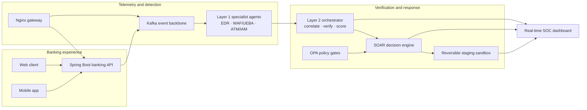
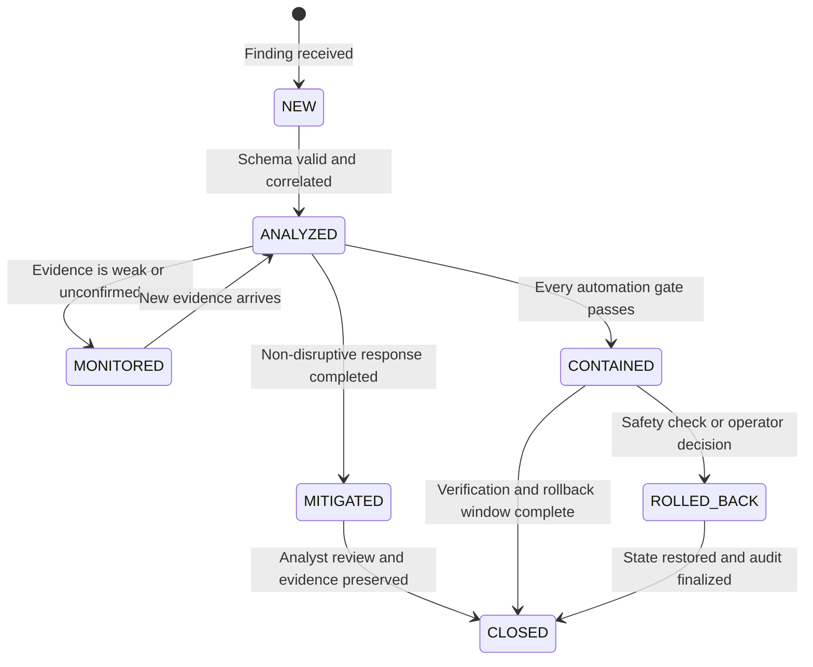
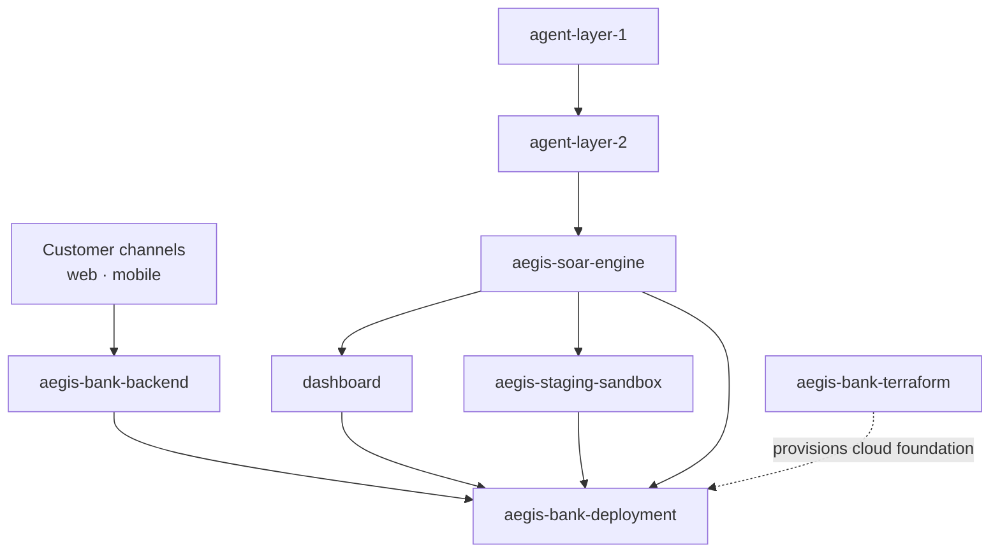

<div align="center">

# Little Boy's Aegis

### An AI-native cyber defense platform for modern banking

From customer transactions to the SOC: observe, correlate, verify, decide, and respond—without surrendering control.

[](https://github.com/orgs/Little-Boy-s-Aegis/repositories)
[](https://attack.mitre.org/)
[](https://capec.mitre.org/)
[](https://www.openpolicyagent.org/)

[Explore the platform](#the-platform) · [See the architecture](#how-aegis-works) · [Run it locally](#run-the-ecosystem) · [Browse every repository](https://github.com/orgs/Little-Boy-s-Aegis/repositories)

</div>

---

## Defense that reasons—and proves its work

Little Boy's Aegis is an end-to-end attack-and-defense environment built around a realistic digital banking system. Banking applications generate real operational telemetry. Specialist, read-only agents inspect that evidence. A second-layer orchestrator correlates and independently verifies findings before the SOAR engine can select a response.

The result is a security platform designed around three convictions:

- **Evidence before action.** Agent findings are signals, not verdicts. Layer 2 verifies them against clean logs and operational context.
- **Automation needs boundaries.** OPA policy, verification gates, scoped targets, approval modes, audit trails, and rollback data stand between a model decision and an environment-changing action.
- **Security should be observable.** Kafka event streams, structured schemas, a real-time SOC dashboard, and deterministic risk tables make the decision path inspectable.

### At a glance

| Capability | Aegis approach |
|---|---|
| Detection | Three read-only specialists examine network/EDR, web/API/UEBA, and ATM/IAM telemetry. |
| Threat mapping | Findings use offline MITRE ATT&CK, CAPEC, and CWE-derived defensive knowledge. |
| Correlation | Layer 2 joins findings only when concrete entities and evidence support the relationship. |
| Verification | Claims are checked against clean logs, database activity, security controls, and operational context. |
| Risk | Deterministic `0–10` scoring combines threat knowledge, asset criticality, evidence, and local context. |
| Response | Playbooks separate non-disruptive SOC actions from policy-gated containment. |
| Governance | OPA authorization, explicit approval modes, immutable audit events, rollback data, and manual-only controls. |
| Delivery | Local Docker, Kubernetes/Helm/Kustomize, and modular AWS Terraform profiles. |

## How Aegis works



### The decision path

1. **Observe** — the banking API, gateway, applications, and infrastructure emit security telemetry.
2. **Detect** — three domain specialists inspect internal network/EDR, e-banking/API/WAF/UEBA, and ATM/IAM signals.
3. **Correlate** — Layer 2 groups findings by concrete entities, time, technique, and plausible attack sequence.
4. **Verify** — claims are checked independently against clean logs and context; unsupported findings are capped or withheld from containment.
5. **Decide** — deterministic ATT&CK/CAPEC risk data and policy rules produce a schema-valid decision and playbook plan.
6. **Respond** — non-disruptive actions can be raised immediately; containment requires every safety gate to pass and remains scoped, reversible, and auditable.

### Contracts between the layers

Aegis treats agent communication as an API, not an informal chat. That boundary makes every handoff testable and keeps authority in the correct layer.

| Boundary | Contract | Responsibility |
|---|---|---|
| Telemetry → Layer 1 | Clean routed events and domain context | Provide factual input without granting write access to the sensor. |
| Layer 1 → Layer 2 | `littleboy.soc.layer1.agent_finding.v4` | Report threat state, finding type, masked evidence, entities, ATT&CK/CAPEC mappings, and prompt-safety metadata. |
| Layer 2 → SOC/SOAR | `littleboy.soc.layer2.orchestrator_decision.v8` | Record correlation, independent verification, final risk, actions, approval modes, audit fields, limitations, and rollback requirements. |
| SOAR → control adapter | Validated action intent | Execute only the target, scope, duration, and connector operation authorized by policy. |

Layer 1 is deliberately unable to emit a final risk score, priority, response mode, playbook choice, containment decision, or operational attack instruction. Layer 2 must be able to explain which evidence changed the outcome and which limitations remain.

### Incident lifecycle



Redis maintains live incident and playbook state, while the audit path records transitions and execution outcomes for the SOC. Correlation uses a short sliding window and concrete entity links—such as account, user, host, IP, session, request, transaction, or object ID—to reduce duplicate incidents without merging unrelated activity.

## The platform

### Security intelligence and automation

| Repository | What it does |
|---|---|
| [`agent-layer-1`](https://github.com/Little-Boy-s-Aegis/agent-layer-1) | Read-only specialist agents for EDR, WAF/UEBA, and ATM/IAM telemetry. Emits masked, schema-validated findings mapped to MITRE ATT&CK and CAPEC. |
| [`agent-layer-2`](https://github.com/Little-Boy-s-Aegis/agent-layer-2) | The orchestration contract: correlation, independent verification, deterministic risk scoring, banking-specific response rules, output schemas, and playbooks. |
| [`aegis-soar-engine`](https://github.com/Little-Boy-s-Aegis/aegis-soar-engine) | Executable Python decision engine with Kafka ingestion, Redis incident state, database verification, policy evaluation, safety gates, rollback, audit integrity, threat-intelligence enrichment, and response connectors. |
| [`aegis-staging-sandbox`](https://github.com/Little-Boy-s-Aegis/aegis-staging-sandbox) | Authenticated simulation APIs for reversible Fortinet, CrowdStrike, Entra ID, and AWS WAF response workflows. |
| [`dashboard`](https://github.com/Little-Boy-s-Aegis/dashboard) | Go and React SOC workspace for live security events, incidents, file-integrity monitoring, attack simulation, and AI-assisted investigation. |

### Banking applications and delivery

| Repository | What it does |
|---|---|
| [`aegis-bank-backend`](https://github.com/Little-Boy-s-Aegis/aegis-bank-backend) | Spring Boot core banking REST API with PostgreSQL persistence, JWT authentication, Kafka event production, and attack/defense controls. |
| [`aegis-bank-web-client`](https://github.com/Little-Boy-s-Aegis/aegis-bank-web-client) | Next.js banking portal for customer workflows and security-control demonstrations. |
| [`aegis-bank-mobile-app`](https://github.com/Little-Boy-s-Aegis/aegis-bank-mobile-app) | Dart/Flutter mobile banking experience connected to the Aegis API. |
| [`aegis-bank-deployment`](https://github.com/Little-Boy-s-Aegis/aegis-bank-deployment) | Complete local and Kubernetes orchestration: Docker Compose, Helm, Kustomize, Nginx, Kafka KRaft, Fluent Bit, OPA, Vault, Redis, Qdrant, and security tests. |
| [`aegis-bank-terraform`](https://github.com/Little-Boy-s-Aegis/aegis-bank-terraform) | Modular AWS infrastructure for cost-optimized hackathon and multi-AZ production profiles, including identity, encryption, observability, edge, data, and AI services. |

### How the repositories fit together



The two agent repositories define behavior and data contracts; the SOAR repository implements the decision runtime; the deployment repository assembles the full application and control plane. This separation allows prompts, schemas, runtime code, integrations, and infrastructure to evolve without collapsing into one privileged component.

## What makes the system different

### Split trust between sensors and decisions

Layer 1 cannot assign final risk, choose playbooks, authorize containment, or execute actions. Its job is to report masked evidence in a strict JSON contract. Layer 2 owns correlation and verification, preventing one confident sensor—or one prompt injection—from becoming an operational decision.

### Policy-gated response

Environment-changing containment is off by default. It requires a confirmed threat, independent Layer 2 verification, sufficient evidence strength and risk, an OPA allow decision, autopilot enablement, an approved execution window, a verified target, and a scoped, time-bound action with rollback available.

Critical banking operations—including core banking, SWIFT, HSM, ATM switch, critical VLAN, and disaster-recovery isolation—are **manual-only**.

#### Auto-containment gate

Every environment-changing action must satisfy all of the following conditions:

| Gate | Why it exists |
|---|---|
| Threat confirmed | Prevents anomaly-only signals from changing the environment. |
| Layer 2 verification performed | Keeps the sensor that raised a finding from validating itself. |
| Verification supported or strong | Requires clean evidence to support the reported behavior. |
| Risk above the response floor | Reserves containment for materially dangerous incidents. |
| OPA allows the action | Applies policy-as-code outside model reasoning. |
| SOC autopilot enabled | Requires an explicit operational opt-in; the default is off. |
| Execution window open | Respects approved change periods and operating conditions. |
| Target entity verified | Blocks actions against inferred, ambiguous, or missing targets. |
| Action scoped, time-bound, and reversible | Limits blast radius and prevents permanent uncontrolled changes. |
| Rollback available | Ensures the platform can restore prior state. |

If any gate fails, Aegis can still preserve evidence, increase monitoring, create a hunt, open or update a ticket, notify the SOC, or queue a recommendation for approval. It cannot silently promote a suggestion into containment.

### Threat knowledge that works offline

The project carries structured MITRE ATT&CK and CAPEC knowledge, surface multipliers, edge-case matrices, and calibrated `0–10` scoring tables. Decisions remain explainable even when external threat-intelligence services are unavailable.

### A full proving ground

The banking API, customer clients, SOC dashboard, multi-broker Kafka backbone, log pipeline, policy engine, secret management, vector database, response sandbox, and test suites run as one ecosystem. This makes Aegis useful for purple-team exercises, defensive AI research, playbook validation, and security engineering demonstrations.

## Defense in depth

| Layer | Controls |
|---|---|
| Edge | Nginx reverse proxy, request routing, security headers, CORS rules, cache controls, and gateway logging. |
| Identity | JWT validation, SOC session controls, CSRF protection, role boundaries, and simulated Entra ID actions. |
| Application | Banking authorization checks, structured validation, security-event production, and attack/defense toggles. |
| Data | PostgreSQL verification records, Redis workflow state, Qdrant defensive context, and Vault-backed secret workflows. |
| Event backbone | Three-node Kafka KRaft cluster, replicated streams, provisioned topics, malformed-event handling, and trusted/untrusted event separation. |
| Detection | Domain-specific Layer 1 agents, prompt-injection indicators, masked evidence, and schema enforcement. |
| Decision | Independent verification, entity correlation, deterministic risk tables, OPA policy, approval modes, and response floors. |
| Response | Connector isolation, rate limits, allowlists, dry-run support, rollback, audit-integrity checks, and staging simulation. |
| Delivery | Container security checks, CI security audits, Kubernetes policies, encrypted cloud resources, and infrastructure observability. |

## Event and response ecosystem

The deployment provides a high-availability Kafka backbone for banking events, gateway and application logs, normalized Layer 1 findings, fast-path detections, orchestrator decisions, and SOC updates. Fluent Bit collects container and gateway logs; the log parser normalizes and routes events to the appropriate specialist; Kafka decouples collection from analysis so the SOC remains observable during individual service restarts.

The SOAR engine supports a connector-oriented response model. Current adapters and simulations cover:

- network and edge response through Fortinet and WAF controls;
- endpoint isolation and reconnection through CrowdStrike-style workflows;
- identity response through Active Directory and Entra ID-style actions;
- intelligence enrichment through AbuseIPDB, Shodan, and VirusTotal connectors;
- notifications and case routing through email, Jira, PagerDuty, Telegram, webhooks, and MQTT;
- safe local exercises through the authenticated staging sandbox.

Connector availability does not imply permission to act. Each action still passes schema validation, policy evaluation, target validation, safety checks, execution controls, and audit recording.

## Technology map

| Area | Technologies |
|---|---|
| Experiences | Next.js, React, TypeScript, Flutter, Dart |
| Banking services | Java, Spring Boot, Hibernate/JPA, PostgreSQL |
| SOC and orchestration | Go, Python, Redis, Qdrant |
| Event and log pipeline | Apache Kafka KRaft, Fluent Bit |
| Security controls | Open Policy Agent, Vault, Nginx, JWT, audit/FIM controls |
| Platform engineering | Docker Compose, Kubernetes, Helm, Kustomize, Terraform, GitHub Actions |
| Threat knowledge | MITRE ATT&CK, CAPEC, CWE, deterministic risk calibration |

## Deployment choices

| Mode | Best for | Included approach |
|---|---|---|
| Local Compose | Demos, development, and purple-team labs | One-command multi-service environment behind the Nginx gateway. |
| Kubernetes local overlay | Cluster validation and platform engineering | Kustomize base plus local patches for the complete control and data plane. |
| Helm | Configurable packaged deployment | Aegis platform chart with service, policy, data-store, and secret configuration. |
| AWS hackathon profile | Cost-conscious cloud demonstrations | Serverless-first and single-AZ choices where appropriate. |
| AWS production profile | Architecture study and hardened adaptation | Multi-AZ networking, separated tiers, encryption, audit, observability, and edge controls. |

The production Terraform profile is an architectural starting point, not a certification. Organizations must apply their own threat model, data residency rules, banking regulations, identity model, key-management policy, disaster-recovery objectives, and change controls.

## Run the ecosystem

The fastest path is the deployment repository:

```bash
git clone https://github.com/Little-Boy-s-Aegis/aegis-bank-deployment.git
cd aegis-bank-deployment
cp .env.example .env
docker compose up --build -d
```

Then open the Nginx gateway at `http://localhost/`. The deployment guide documents the banking portal, SOC dashboard, APIs, Kafka tooling, service profiles, and Kubernetes options.

> [!IMPORTANT]
> Review every value in `.env` before use. Default and example credentials are for isolated local development only. Do not expose the stack—or its simulated vulnerable modes—to an untrusted network.

### What starts locally

The deployment composes the customer web portal, Spring Boot banking API, Go SOC backend, React SOC frontend, PostgreSQL, Redis, Qdrant, a three-broker Kafka cluster, log collection and parsing, OPA, Vault, the SOAR engine, staging controls, and the Nginx gateway. Optional profiles and repository guides cover additional integrations.

### Useful operating commands

```bash
# Follow the platform logs
docker compose logs -f

# Inspect the Kafka and parsing path
docker compose logs -f kafka-1 kafka-2 kafka-3 fluent-bit log-parser

# Stop services without deleting persisted data
docker compose down
```

Use `docker compose down -v` only when you intentionally want to delete local database and event-stream volumes.

## Validation philosophy

Aegis uses multiple validation layers because passing unit tests alone does not prove that a security control works across service boundaries.

- **Contract tests** validate Layer 1 and Layer 2 JSON schemas and required safety fields.
- **Unit tests** cover policy evaluation, playbook routing, rollback, rate limiting, secret handling, notifications, and audit integrity.
- **Integration tests** exercise Kafka, Redis, PostgreSQL verification, the staging sandbox, and connector behavior.
- **Platform tests** inspect container security, frontend protections, prompt behavior, and SOAR controls.
- **Adversarial suites** probe authentication, authorization, JWT handling, injection, XSS, event forgery, resilience, exposed services, secrets, and gateway behavior while preserving evidence per case.
- **CI security checks** provide repeatable repository-level quality gates; environment-specific results remain separate from this organization profile.

Security findings are not hidden behind a marketing badge. A failed check represents a control or configuration to investigate, while a blocked check means coverage was incomplete—not that the target passed.

## Start where you work

| If you are a… | Begin with… | You can contribute… |
|---|---|---|
| Detection engineer | [`agent-layer-1`](https://github.com/Little-Boy-s-Aegis/agent-layer-1) | Telemetry mappings, masked evidence rules, ATT&CK/CAPEC coverage, and prompt-safety tests. |
| SOC analyst | [`dashboard`](https://github.com/Little-Boy-s-Aegis/dashboard) | Incident workflows, investigation views, triage ergonomics, reporting, and analyst feedback loops. |
| SOAR engineer | [`aegis-soar-engine`](https://github.com/Little-Boy-s-Aegis/aegis-soar-engine) | Verification sources, playbooks, connectors, safety gates, rollback, and auditability. |
| Application security engineer | [`aegis-bank-backend`](https://github.com/Little-Boy-s-Aegis/aegis-bank-backend) | Banking abuse cases, authorization controls, secure events, and defensive test coverage. |
| Platform engineer | [`aegis-bank-deployment`](https://github.com/Little-Boy-s-Aegis/aegis-bank-deployment) | Kubernetes, Helm, policy, secrets, observability, resilience, and supply-chain controls. |
| Cloud architect | [`aegis-bank-terraform`](https://github.com/Little-Boy-s-Aegis/aegis-bank-terraform) | AWS landing-zone design, IAM, encryption, networking, cost controls, and reliability. |
| AI safety researcher | [`agent-layer-2`](https://github.com/Little-Boy-s-Aegis/agent-layer-2) | Trust boundaries, structured decisions, verification caps, prompt-injection resistance, and evaluation cases. |

## Built for safe experimentation

Little Boy's Aegis is a research, education, and security-simulation project—not a certified banking product or a substitute for production security controls. Run offensive scenarios only in systems you own or are explicitly authorized to test. Validate policies, secrets, network boundaries, connectors, and rollback behavior before adapting any component to a real environment.

The project intentionally includes attack simulation and configurable vulnerable behaviors for defensive evaluation. Keep those modes isolated, use synthetic data, rotate every example credential, and never connect a lab control adapter to production infrastructure.

## Explore and contribute

Start with [`aegis-bank-deployment`](https://github.com/Little-Boy-s-Aegis/aegis-bank-deployment) to experience the complete system, or enter through the repository that matches your craft:

- Detection engineering: [`agent-layer-1`](https://github.com/Little-Boy-s-Aegis/agent-layer-1)
- Decision contracts and playbooks: [`agent-layer-2`](https://github.com/Little-Boy-s-Aegis/agent-layer-2)
- SOAR and integrations: [`aegis-soar-engine`](https://github.com/Little-Boy-s-Aegis/aegis-soar-engine)
- SOC experience: [`dashboard`](https://github.com/Little-Boy-s-Aegis/dashboard)
- Platform engineering: [`aegis-bank-deployment`](https://github.com/Little-Boy-s-Aegis/aegis-bank-deployment) and [`aegis-bank-terraform`](https://github.com/Little-Boy-s-Aegis/aegis-bank-terraform)

Open an issue or pull request in the repository you want to improve. When proposing response automation, include its evidence requirements, authorization policy, blast-radius limit, audit fields, and rollback path.

---

<div align="center">

**Little Boy's Aegis — intelligence at machine speed, control at human depth.**

[All repositories](https://github.com/orgs/Little-Boy-s-Aegis/repositories)

</div>
